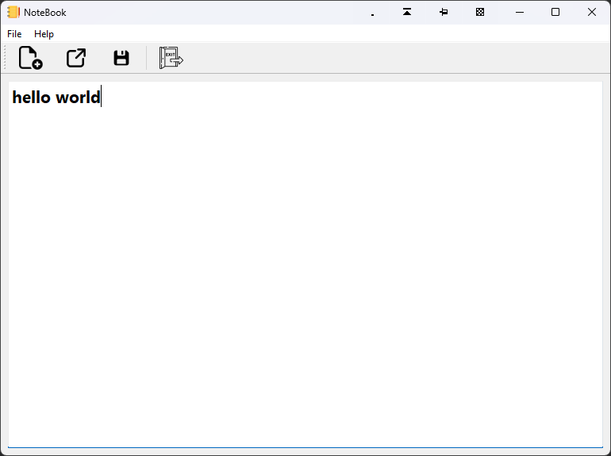

# NoteBook

This project is a simple notebook with some simple buttons to open , save and new note .

---

1. Open a file ( < txt, cpp, md > and other text files)
2. Overwrite a file with save button (first, you must open the file with the open button, then save the changes)
3. new note

---
 
 

